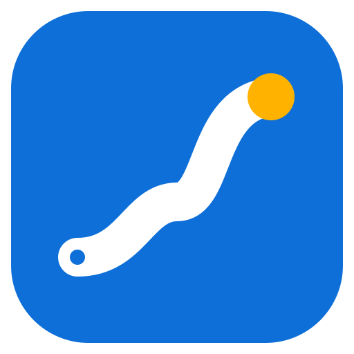
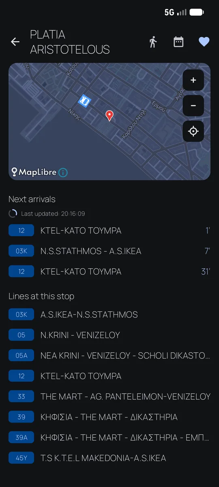
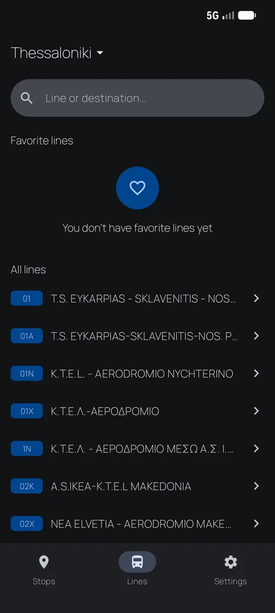
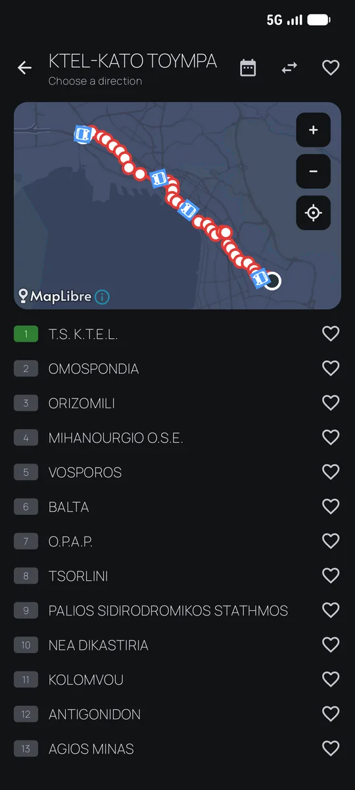
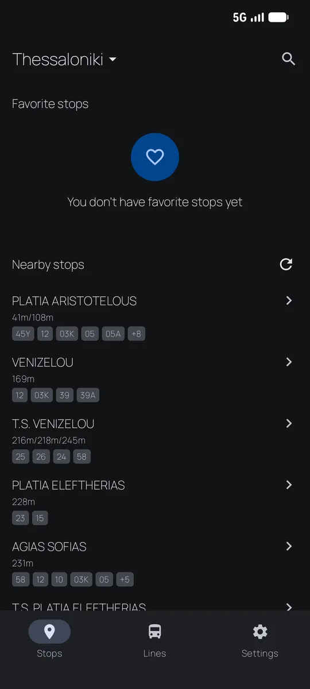
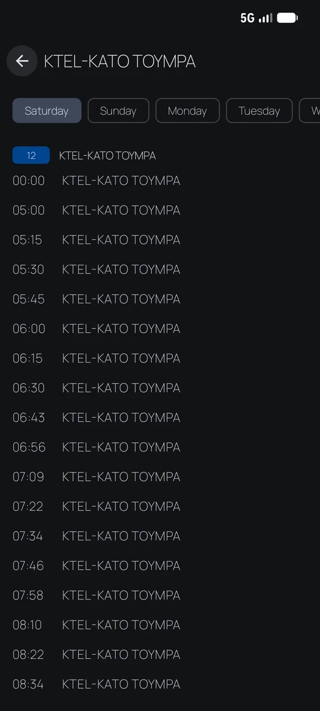
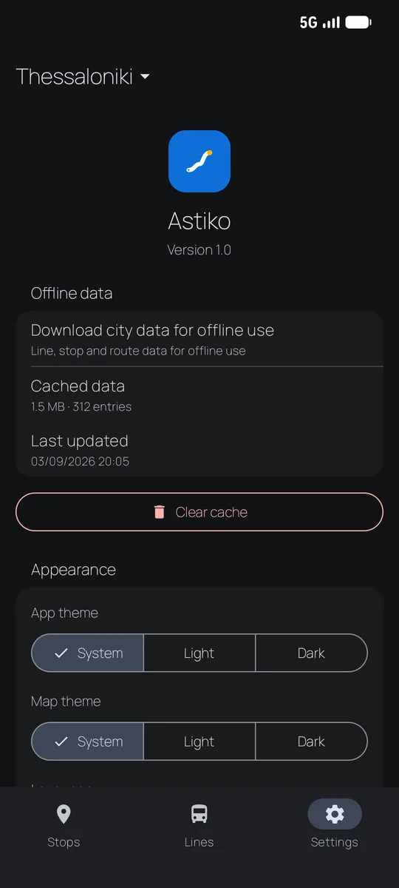

<h1 align="center">Astiko</h1>

<b>Live arrivals, full-day timetables and live bus maps for 26 Greek cities.</b>

## Screenshots

Dark theme. Light theme screenshots live in [assets/screenshots/light](assets/screenshots/light).

## Features

- Stops near you via GPS, favorites, and a chooser when two nearby stops share a name
- Live arrival countdowns (15 s polling) with live bus positions on the arrivals map
- Line browser: search, direction, ordered stops, arrivals per stop
- Day-of-week timetables with the next departure highlighted and passed trips dimmed
- Live line map: route polyline, stop pins, buses in transit (MapLibre + OpenFreeMap)
- Offline cache with per-city prefetch, offline arrivals fall back to the schedule
- One tap from a stop to walking directions in a maps app (Google Maps)

## Data sources

| Provider | Cities | Data |
|---|---|---|
| `telematics.oasa.gr` | Athens | stops, arrivals, live vehicles, route geometry |
| `oseth.com.gr` | Thessaloniki | routes, timetables, arrivals, vehicles, geometry |
| `data.gov.gr` (GTFS) | Thessaloniki | stop catalog (stop names, coordinates, line badges) |
| `rest.citybus.gr` | 24 cities | stops, arrivals (+ bus GPS), lines, timetables, geometry |

All APIs are unofficial. The Thessaloniki stop catalog is derived from the OSETH GTFS feed on [data.gov.gr](https://data.gov.gr/dataset/dedomena-astikon-sygkoinonion-p-e-thessalonikis) (`Δεδομένα αστικών συγκοινωνιών Π.Ε. Θεσσαλονίκης`), published under [CC BY 4.0](https://creativecommons.org/licenses/by/4.0/).

## Contribution

Bug reports and pull requests are welcome.

## License

[MIT](LICENSE). The app is not affiliated with any transport operator, and the transit data belongs to the providers.

Bundled third-party components keep their own licenses (see [THIRD_PARTY_NOTICES.md](THIRD_PARTY_NOTICES.md) and the in-app "Open source licenses" screen): the Manrope font (SIL OFL 1.1), MapLibre (BSD-2-Clause) and map data © OpenStreetMap contributors (ODbL, served via OpenFreeMap). Transit data belongs to the providers: the ΟΣΕΘ GTFS feed from data.gov.gr is used under CC BY 4.0, and the telematics data comes from the operators' public systems.
